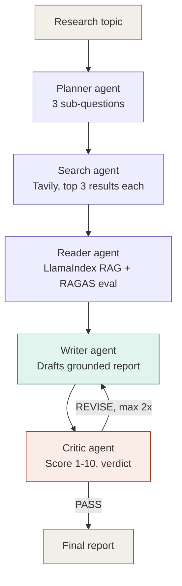

# AutoResearch

A five-agent autonomous research pipeline that takes a topic, plans sub-questions, searches the web, reads and grounds evidence via RAG, drafts a report, and self-corrects through an LLM-as-judge feedback loop — with RAGAS evaluation on retrieval quality.

Built as a hands-on project to learn agentic AI system design: LangGraph state machines, RAG over live web content, structured LLM output, and self-correcting agent loops.

## What it does

You give AutoResearch a topic. It:

1. **Plans** — breaks the topic into 3 focused sub-questions
2. **Searches** — queries the web for each sub-question via Tavily
3. **Reads** — builds an ephemeral vector index over the retrieved pages and extracts grounded, cited answers per sub-question
4. **Writes** — drafts a structured report (introduction, per-sub-question findings with citations, conclusion) from *only* the evidence gathered — with explicit anti-hallucination constraints in the prompt
5. **Critiques** — an LLM-as-judge scores the draft 1-10 on grounding, completeness, and clarity, and returns a PASS/REVISE verdict
6. If REVISE, the Writer gets the specific issues and rewrites — capped at 2 revision cycles to guarantee termination

Retrieval quality is independently measured with **RAGAS** (faithfulness, answer relevancy, context precision, context recall) — not just self-reported by the pipeline's own Critic.

## Architecture



Two failure paths (omitted above for clarity, see `graph/routing.py`): if the Reader can't retrieve any content, the pipeline short-circuits to a "insufficient evidence" report instead of hallucinating; if the Writer's LLM backend fails after 5 retries, it returns a clear failure message instead of an empty report.

## Tech stack

| Layer | Choice |
|---|---|
| Agent orchestration | LangGraph (StateGraph, conditional edges) |
| LLM inference | NVIDIA API (`openai/gpt-oss-120b`) via `langchain-openai` |
| Structured output | Pydantic + `.with_structured_output()` |
| Web search | Tavily API |
| RAG | LlamaIndex + ChromaDB (ephemeral, per-session index) |
| Embeddings | HuggingFace `BAAI/bge-small-en-v1.5` (local, offline) |
| Evaluation | RAGAS (faithfulness, answer relevancy, context precision, context recall) |
| Observability | LangSmith tracing |
| UI | Streamlit |

## Example output

> **Topic:** "How do vector databases handle approximate nearest neighbor search?"
>
> **Result:** Quality score 8/10, 1 revision, 9 sources cited, RAGAS faithfulness 0.9+
>
> The report covers indexing structures (HNSW/IVF/PQ), the accuracy-vs-latency tradeoff via tunable parameters, and hardware acceleration — each finding traced back to a specific source URL, with the Critic flagging and the Writer fixing an under-cited claim on the first pass.

*(Swap this for a real sample from your own run — a short excerpt plus the quality/RAGAS scores is more convincing than a full report dump.)*

## Project structure

```
day_24/
├── app.py                 # Streamlit entry point
├── config/                # env loading, constants
├── clients/                # LLM + Tavily clients
├── schemas/                # Pydantic models, LangGraph state
├── agents/                 # Planner, Searcher, Reader, Writer, Critic
├── graph/                  # routing logic + build_graph()
├── evaluation/              # RAGAS evaluation
├── ui/                      # Streamlit components
└── tests/
    ├── test_routing.py      # fast, no API calls
    ├── test_helpers.py      # fast, no API calls
    └── run_e2e_topics.py    # real end-to-end run across 20 topics
```

## Running it

```bash
git clone https://github.com/<your-username>/autoResearch-agent.git
cd autoResearch-agent/day_24
python -m venv .venv
.venv\Scripts\activate          # Windows
pip install -r requirements.txt --break-system-packages
cp .env.example .env            # fill in your API keys
streamlit run app.py
```

Requires API keys for NVIDIA (LLM inference), Tavily (web search), and optionally LangSmith (tracing).

## Testing

```bash
pytest tests/test_routing.py tests/test_helpers.py -v   # unit tests, free, instant
python tests/run_e2e_topics.py --limit 5                # smoke test, real API calls
python tests/run_e2e_topics.py                           # full 20-topic end-to-end run
```

## What I'd improve next

- Reader Agent fetches URLs sequentially — parallelizing with `asyncio.gather()` would meaningfully cut per-topic latency
- No persistent storage — every run's index and history live only in the Streamlit session
- RAGAS uses the generated answer as a proxy reference (no human-labeled ground truth), which makes `context_precision`/`context_recall` self-consistency metrics rather than true accuracy measures
